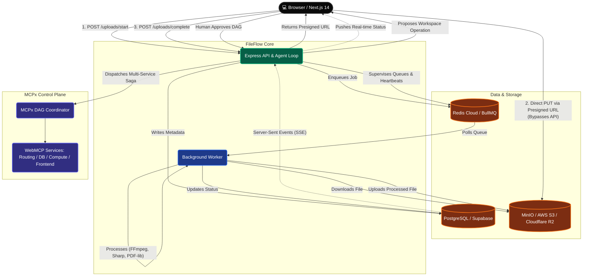

# FileFlow — System Architecture & Autonomous Operations Control Plane

> A distributed, async file-processing platform and governed autonomous operations system. Users upload images, PDFs, and videos through a Next.js frontend, an Express API issues direct presigned storage URLs, a BullMQ queue system dispatches transformations to background workers, results stream via Server-Sent Events (SSE), and an **Autonomous AI Operations Agent** supervises pipeline telemetry, executes self-healing DLQ failure replays, and governs multi-service workspace provisioning via **MCPx**.

---

## Table of Contents

1. [High-Level Overview](#1-high-level-overview)
2. [Infrastructure & Cloud Deployment](#2-infrastructure--cloud-deployment)
3. [Backend — Express API](#3-backend--express-api)
4. [Queue System — BullMQ](#4-queue-system--bullmq)
5. [Worker Process](#5-worker-process)
6. [File Processors](#6-file-processors)
7. [Dead-Letter Queue (DLQ)](#7-dead-letter-queue-dlq)
8. [Worker Metrics & Heartbeat](#8-worker-metrics--heartbeat)
9. [Storage — MinIO / S3 / Cloudflare R2](#9-storage--minio--s3--cloudflare-r2)
10. [Database — PostgreSQL](#10-database--postgresql)
11. [Frontend — Next.js 14](#11-frontend--nextjs-14)
12. [Authentication & Authorization](#12-authentication--authorization)
13. [Real-Time Status — SSE](#13-real-time-status--sse)
14. [Admin Dashboard](#14-admin-dashboard)
15. [Complete Request Lifecycle](#15-complete-request-lifecycle)
16. [File & Folder Structure](#16-file--folder-structure)
17. [Autonomous Operations Agent (`OBSERVE -> DECIDE -> ACT -> VERIFY`)](#17-autonomous-operations-agent)
18. [Governed Multi-Service Orchestration via MCPx](#18-governed-multi-service-orchestration-via-mcpx)

---

## 1. High-Level Overview



---

## 2. Infrastructure & Cloud Deployment

FileFlow supports local development via Docker and cloud deployment on managed services:

| Component | Local Development | Production Service | Purpose |
|---|---|---|---|
| **Relational Database** | PostgreSQL (`5433→5432`) | Supabase PostgreSQL | Users, upload metadata, workspace state, transaction audit |
| **Message Broker & Cache** | Redis 7 (`6379`) | Redis Cloud | BullMQ queues (`image`, `pdf`, `video`, `dlq`), worker heartbeats |
| **Object Storage** | MinIO (`9000` / `9001`) | Cloudflare R2 / AWS S3 | Direct browser presigned ingestion & processed asset storage |
| **API & Agent Loop** | Node.js (`localhost:4000`) | Render Web Service | Express REST API, SSE push, LLM evaluation, DLQ replays |
| **Background Worker** | Node.js (`worker/index.js`) | Render Worker Service | Standalone Sharp / FFmpeg / pdf-lib transformation engine |
| **Frontend & Console** | Next.js 14 (`localhost:3005`) | Vercel | End-user dashboard, SSE progress, Operations Agent UI |
| **MCPx Control Plane** | Next.js (`localhost:3000-3004`) | Vercel | Multi-service WebMCP tool registry & Saga orchestrator |

---

## 3. Backend — Express API

**Entry point:** `Backend/index.js`  
**Port:** `4000`  
**Module system:** ESM (`"type": "module"`)

### Key Routes

| Method | Path | Auth | Description |
|---|---|---|---|
| `GET` | `/health` | None | Liveness probe |
| `POST` | `/auth/register` | None | Account creation (bcrypt hash, stores in `users`) |
| `POST` | `/auth/login` | None | Password verification → issues signed JWT |
| `POST` | `/uploads/start` | User | Issues short-lived S3 presigned PUT URL |
| `POST` | `/uploads/complete` | User | Verifies S3 upload, marks `UPLOADED`, enqueues BullMQ job |
| `GET` | `/uploads/:id/stream` | User (token) | Server-Sent Events (SSE) status stream |
| `GET` | `/uploads/:id/download` | User | Streams processed asset directly to browser |
| `GET` | `/agent/observe` | None | Aggregates live queue depths, worker heartbeat, DLQ, and workspaces |
| `POST` | `/agent/evaluate` | None | Evaluates telemetry with Gemini 2.0 Flash and executes self-healing action |
| `POST` | `/workspaces/provision` | User/Admin | Executes governed multi-service workspace orchestration via MCPx |

---

## 4. Queue System — BullMQ

**File:** `Backend/src/queue.js`  
**Backed by:** Redis

Three type-isolated queues prevent resource starvation:
- `image-processing` (concurrency: 10)
- `pdf-processing` (concurrency: 5)
- `video-processing` (concurrency: 2)

```javascript
const JOB_DEFAULTS = {
  attempts: 5,
  backoff: { type: "exponential", delay: 2000 },
  removeOnComplete: true,
  removeOnFail: false,
};
```

---

## 5. Worker Process

**Entry point:** `worker/index.js`  
**Runs as:** An independent background process.

- Wraps all job processing inside the `makeHandler(processor)` factory.
- Uses optimistic locking (`UPDATE uploads SET status='PROCESSING' WHERE status='UPLOADED'`) to guarantee single-execution idempotency.
- Writes heartbeat to Redis key `worker:heartbeat` every 10 seconds (TTL: 30s).
- Moves permanently failed jobs to the Dead-Letter Queue (`dlq`) after 5 exhausted retries.

---

## 6. File Processors

- **Image Processor (`imageProcessor.js`):** Uses **Sharp** to resize to max 800px width and convert to standard PNG.
- **PDF Processor (`pdfProcessor.js`):** Uses **pdf-lib** to compress and stamp provenance metadata.
- **Video Processor (`videoProcessor.js`):** Uses **fluent-ffmpeg** to transcode to 720p H.264 MP4 with faststart flags and extract 1-second preview thumbnails.

---

## 7. Dead-Letter Queue (DLQ)

When all retries fail, jobs land in the BullMQ `dlq` queue with detailed error stacks and payloads:
- Replayable via `POST /admin/dlq/:jobId/replay` or autonomously by the Operations Agent.
- DLQ replay resets status to `UPLOADED`, re-enqueues into the appropriate type queue, and removes the DLQ entry.

---

## 8. Worker Metrics & Heartbeat

- `worker:heartbeat` (TTL 30s): Epoch millisecond timestamp.
- `worker:metrics` (TTL 60s): JSON payload of processing durations and file sizes.

---

## 9. Storage — MinIO / S3 / Cloudflare R2

- `raw/{uploadId}/{originalFilename}` — Direct browser upload via presigned URL.
- `processed/{uploadId}/output.[png|pdf|mp4]` — Processed asset stored by worker.
- `processed/{uploadId}/thumbnail.jpg` — Video thumbnail preview.

---

## 10. Database — PostgreSQL

Key tables:
- `users`: ID, email, password hash, created_at.
- `uploads`: ID, user_id, filename, mime_type, size, status (`CREATED`, `UPLOADED`, `PROCESSING`, `PROCESSED`, `FAILED`), raw_key, processed_key, error_message.
- `workspaces`: ID, name, environment, status (`READY`, `FAILED`, `PENDING`), provisioned resources, mcpx_transaction_id.
- `transactions`: MCPx transaction logs, state, rollback status, and audit metadata.

---

## 11. Frontend — Next.js 14

- `/upload`: Live upload zone with SSE step tracker and simulated heavy load button.
- `/uploads`: File inventory with instant downloads and delete management.
- `/operator`: Autonomous Operations Agent dashboard with live telemetry, Gemini decision rationale, 4-step activity logs, and MCPx DAG timelines.
- `/admin`: Metrics overview, queue monitor, failed uploads, DLQ manager, user storage analytics.

---

## 12. Real-Time Status — SSE

`GET /uploads/:id/stream` streams status transitions directly to the browser with zero polling overhead.

---

## 13. Autonomous Operations Agent

```
                   ┌───────────────────────────────────────────┐
                   │               PERSISTENT GOAL             │
                   │ "Keep FileFlow's pipeline healthy and     │
                   │ recover failed jobs while requiring       │
                   │ human approval for workspace operations"  │
                   └─────────────────────┬─────────────────────┘
                                         │
                                         ▼
┌─────────────────────────────────────────────────────────────────────────────┐
│ 1. OBSERVE (GET /agent/observe)                                             │
│    • Redis Worker Heartbeat (online/offline & seconds ago)                  │
│    • BullMQ Queue depths (waiting, active, failed, dlqWaiting)               │
│    • PostgreSQL pending & failed upload records                             │
│    • Active workspaces and MCPx coordinator reachability                    │
└──────────────────────────────────────┬──────────────────────────────────────┘
                                       │
                                       ▼
┌─────────────────────────────────────────────────────────────────────────────┐
│ 2. DECIDE (POST /agent/evaluate via Gemini 2.0 Flash)                       │
│    ├── Pipeline healthy       ──► NO_ACTION_REQUIRED                        │
│    ├── Replayable DLQ job     ──► AUTONOMOUS_ACTION (replay_failed_job)     │
│    ├── Worker process dead    ──► BLOCKED (awaiting worker reboot)          │
│    └── Workspace requested    ──► PROPOSAL_REQUIRED (request approval)      │
└──────────────────────────────────────┬──────────────────────────────────────┘
                                       │
                    ┌──────────────────┴──────────────────┐
                    ▼                                     ▼
┌──────────────────────────────────────┐ ┌────────────────────────────────────┐
│ 3A. AUTONOMOUS ACTION                │ │ 3B. GOVERNED PROPOSAL              │
│ • Atomic DLQ extraction              │ │ • Interactive human review card    │
│ • Reset upload status to UPLOADED    │ │ • Dispatches MCPx multi-service    │
│ • BullMQ routes to worker            │ │   DAG transaction upon approval    │
└──────────────────┬───────────────────┘ └─────────────────┬──────────────────┘
                   │                                       │
                   └───────────────────┬───────────────────┘
                                       ▼
┌─────────────────────────────────────────────────────────────────────────────┐
│ 4. VERIFY                                                                   │
│    • Re-sample pipeline telemetry                                           │
│    • Confirm DLQ count = 0 and file status = PROCESSED in DB/S3             │
└─────────────────────────────────────────────────────────────────────────────┘
```

### Key Agent Invariants
1. **Real Telemetry Only:** Telemetry reflects actual Redis keys, BullMQ job counts, and PostgreSQL rows.
2. **Bounded Autonomy:** The agent can autonomously replay low-risk transient DLQ failures, but **never** provisions multi-service infrastructure without explicit human approval.
3. **Causal Integrity:** Replaying a job re-enqueues it into BullMQ for the active worker; workspace provisioning dispatches multi-step WebMCP tools through MCPx.

---

## 14. Governed Multi-Service Orchestration via MCPx

When a workspace operation is approved, FileFlow invokes the **MCPx Coordinator** (`@mcpxx/sdk`):

1. **WebMCP Browser Tool Discovery:** Dynamically discovers tools declared on independent microservices (`routing-app`, `database-app`, `compute-app`, `frontend-app`).
2. **Dependency DAG Execution:** Constructs and executes an optimal execution graph across services.
3. **Saga Reverse Compensation:** If any step fails during execution, MCPx automatically rolls back completed steps in reverse order (e.g. freeing compute resources and releasing routing rules).
4. **PostgreSQL Durability:** Every transaction step, payload, and compensation status is persisted for auditability.
